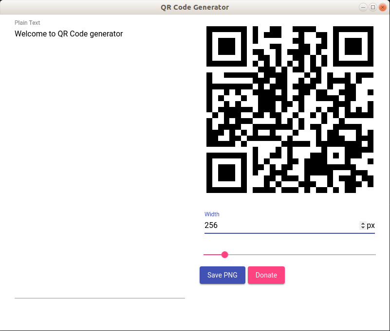

# QR Code Generator

 

An application created for a friend. Based on the electron platform. The generator offers:

* Preview how the QR code changes when entering text
* Write to the PNG file generated QR code
* Changing the image size before saving

## Shortcuts

* `ctrl+n` - **New window**
* `ctrl+w, ctrl+q` - **Close window**
* `ctrl+s` - **Save QR code to png**

## Also

* [QR Code Generator web version](https://studiolacosanostra.github.io/apps/qr-code-generator/)
* [QR Code Generator android version](https://play.google.com/store/apps/details?id=com.studiolaCosaNostra.qrCodeGenerator)
